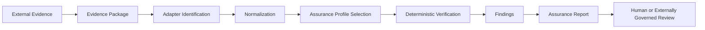

# Guard External Evidence Assurance Platform v0.1

## 1. Purpose

This document freezes the architecture baseline for Guard External Evidence Assurance Platform `v0.1`.

This PR is docs-only.
It does not extend the Ramen-specific implementation line.
It does not introduce a runtime platform, control plane, approval path, blocking path, certification path, deployment gate, billing system, or customer account logic.

MindForge Guard independently verifies declared properties of externally issued runtime AI evidence and produces scoped findings for human or externally governed review.

Verification findings are advisory and additive. They do not approve, block, authorize, certify, or execute external actions.

## 2. Current State And Target Model

Current `main` already contains:

- External Evidence Framework boundary and Phase 2 type-only freeze
- type-only external evidence and registry contracts
- reviewer-facing registry documents
- Ramen Receipt v5 reference mapping documents
- one bounded local-only Ramen adapter spike

The target model defined here is the next platform-level documentation baseline above those artifacts.
It explains the generic platform objects, the producer-neutral verification lifecycle, the stable specification boundary, the per-source asset model, the per-job report model, and the deferred implementation order.

This document is architecture-first.
It is not a product promise, runtime design approval, or implementation authorization.

## 3. Core Positioning

MindForge Guard is an independent evidence assurance platform for runtime AI evidence.

External systems issue evidence.
Guard verifies evidence.

Guard remains:

- recommendation-only
- additive-only
- verification-only for this platform line
- non-executing
- non-control-plane
- human-review-oriented
- producer-independent

Guard does not become:

- an approval surface
- a blocking surface
- a runtime enforcement surface
- a deployment gate
- a policy enforcement authority
- an execution controller
- a certification authority
- a trust designation authority
- a producer authorization authority

## 4. Generic Platform Objects

The generic platform model is built from six bounded objects with one directional relationship:

`Evidence Package -> Adapter Manifest -> Normalized Evidence Record -> Assurance Profile -> Verification Job -> Assurance Report`

### 4.1 Evidence Package

An `EvidencePackage` is the submitted collection of producer-issued evidence that Guard receives for one verification attempt.

It must:

- contain one or more evidence records
- preserve producer-issued evidence without converting it into Guard-issued truth
- carry package identity, digest, or equivalent integrity reference
- preserve provenance to the external producer or source system

It must not:

- become trusted because it entered Guard
- become compliant because it entered Guard
- become authorized because it entered Guard

### 4.2 Adapter Manifest

An `AdapterManifest` describes how one evidence source is identified, parsed, and normalized.

It should declare at least:

- producer or evidence type identification
- supported schema and version range
- field mapping expectations
- supported assurance profiles
- declared limitations
- adapter version

Registry or manifest presence describes adapter capability and scope. It does not confer producer trust, certification, approval, or privileged status.

An adapter manifest is not a trust registry entry.
A registry entry is not producer authorization.

For a new evidence source, the minimum expected addition is:

- one adapter manifest
- one source schema or version declaration
- one necessary deterministic transformer if normalization requires it
- bounded fixtures if later separately scoped
- explicit limitation declarations

Per-source work must stay lightweight.
New sources should not require full architecture, readiness, checklist, proposal, or product-line document chains unless platform-level semantics change or a new material risk boundary appears.

### 4.3 Normalized Evidence Record

A `NormalizedEvidenceRecord` is the producer-neutral Guard-owned review artifact created from source evidence.

It must:

- preserve raw evidence references and provenance
- preserve adapter limitations
- preserve unknown, missing, redacted, confidential, and unsupported states explicitly
- avoid inferring `verified` from absent or unknown information

Normalization is not approval.
Normalization does not remove producer-specific limitations.
Normalization does not convert missing information into trusted information.

### 4.4 Assurance Profile

An `AssuranceProfile` defines the deterministic set of checks requested for one verification attempt.

Profiles may cover checks such as:

- structural validity
- required-field completeness
- payload binding
- digest integrity
- signature validity
- temporal consistency
- provenance completeness
- evidence-chain completeness

An assurance profile defines checks, not policy authority.

Cryptographic validity establishes only the verified integrity or signature claim within the declared scope. It does not establish authorization, safety, compliance, policy correctness, or operational acceptability.

### 4.5 Verification Job

A `VerificationJob` is the primary business, audit, and metering unit of the future platform line.

It should carry at least:

- verification ID
- evidence package reference
- adapter and profile versions
- requested checks
- execution timestamp
- deterministic results
- usage or metering metadata
- status and visible limitations

One verification job is the technical unit for per-run accounting and the bounded unit for future commercial metering discussion.

A verification job is not an approval decision.
Job completion does not prove that evidence is accepted.
Guard does not decide whether an external system may continue execution.

### 4.6 Assurance Report

An `AssuranceReport` is the primary per-job customer-facing delivery artifact.

It should include at least:

- verification ID
- evidence producer and source type
- evidence package digest or equivalent package reference
- adapter version
- assurance profile version or versions
- executed checks
- verified claims within scope
- failed checks
- unresolved findings
- missing evidence
- scope limitations
- human-review recommendations
- Guard engine and report schema version
- report timestamp
- report integrity reference or digest

A completed verification job produces a scoped assurance report. It does not produce a certificate, approval record, deployment authorization, or compliance determination.

An assurance report is a scoped verification report.
It is not a certificate, trust seal, compliance record, or execution authorization.

## 5. Producer-Neutral Verification Lifecycle

The generic lifecycle is:

Lifecycle rules:

- Guard does not execute external actions inside this flow.
- Guard does not block or control the producer runtime.
- External systems and human reviewers retain decision authority.
- Findings are additive review inputs.
- Original evidence and verification results must remain distinguishable.
- `unsupported`, `unverified`, `failed`, and `missing` must remain distinct states.

This lifecycle answers the platform question of how one verification attempt flows from input to report without converting Guard into a runtime authority surface.

## 6. Stable Platform Specs vs Lightweight Source Assets

Platform-level stable specifications are:

- External Evidence Contract
- Normalized Evidence Record contract
- Assurance Profile specification
- Verification Findings Taxonomy
- Adapter Manifest specification
- Assurance Report schema
- report-language boundary
- verification lifecycle and versioning rules

Per-source lightweight assets are:

- one adapter manifest
- source schema or version declaration
- necessary deterministic transformer
- bounded fixtures when separately justified
- adapter-specific limitation declarations

Per-verification generated artifacts are:

- verification job record
- findings
- usage or metering record
- assurance report
- report digest or equivalent integrity reference

The default anti-pattern is prohibited:

`New source -> proposal doc -> checklist doc -> implementation-plan doc -> readiness-summary doc -> source-specific product line`

Architecture documents should change only when platform-level semantics change or a new material boundary risk appears.

## 7. Per-Job Assurance Report Model

Each verification run should generate one scoped per-job report package centered on the assurance report.

That per-job delivery model is:

- one verification job record
- one findings set
- one usage record
- one assurance report
- one report integrity reference

This model ensures the main customer artifact is the per-job assurance report, while preserving enough technical lineage for reviewer trust and deterministic replay of what was checked.

## 8. Metering Boundary

The metering unit is:

- one verification job

Usage dimensions may include:

- evidence package count
- evidence record count
- assurance profile count
- verification check count
- cryptographic operation count
- evidence-chain depth
- report generation
- retention tier
- optional human-review flag

Metering does not change the verification-only boundary.
Charging does not imply trust.
Paid reporting does not imply compliance, safety, or approval.

This document does not introduce billing, payments, subscriptions, or customer account logic.

## 9. Semantic Ownership Boundary

The following semantics belong to Guard:

- scoped verification language
- normalized review artifacts
- findings taxonomy
- assurance profile execution results
- assurance report generation

The following semantics remain outside Guard:

- runtime execution truth outside declared evidence scope
- approval and blocking decisions
- producer trust designation
- deployment authorization
- safety or compliance determination
- final human or external governance decision

## 10. Ramen Position In The Generic Model

Ramen Receipt v5 is one non-privileged reference application of the generic verification model.

Ramen remains:

- the first reference application
- a possible input shape into the generic verification lifecycle
- a bounded example of source-specific mapping

Ramen does not become:

- the platform center
- the default adapter
- the runtime source of truth
- a privileged branch inside Guard core
- a control plane

The generic platform model should eventually allow Ramen evidence to flow through the same lifecycle and produce the same class of assurance report as other sources.

This document does not authorize changes to the existing Ramen local spike.
It does not authorize package exports for any adapter.
It does not authorize aggregate verify wiring for source-specific verifiers.

## 11. Deferred Implementation Order

### PR 1

This PR: docs-only platform architecture baseline.

### PR 2

Type-only platform contracts may be added or expanded for:

- `EvidencePackage`
- `AdapterManifest`
- `AssuranceProfile`
- `VerificationRequest`
- `VerificationJob`
- `AssuranceReport`
- `VerificationUsageRecord`

PR 2 must remain:

- type-only
- non-exported unless separately justified
- non-executing
- no dynamic loading
- no billing
- no API
- no `audit` / `permit` / `classify` wiring

### PR 3

Only after PR 2 lands should Guard evaluate a static boundary verifier for confirming:

- forbidden authority methods absent
- no runtime registry
- no dynamic loading
- no producer-specific privileged fields
- no approval, blocking, or certification semantics

### PR 4

Only after generic type stability should Guard evaluate one local-only, deterministic, non-exported generic report-generation fixture.

Ramen may serve as one example input, but the generic implementation must not introduce Ramen-specific privileged branches.

## 12. Boundary Statements

The platform baseline for `v0.1` is:

- docs-only in this PR
- architecture-first
- producer-neutral
- concise but complete
- explicit about current state, target model, and deferred implementation
- not a control-plane definition
- not a certification definition
- not a runtime authority definition

Forbidden in this PR:

- Ramen implementation changes
- standalone Ramen verifier changes
- real Ed25519 verification
- real payload hash computation
- real keys, production evidence, or network calls
- fixtures or conformance vectors
- package export changes
- runtime registry construction
- dynamic adapter loading
- `audit` / `permit` / `classify` integration
- approval, blocking, certification, or deployment APIs
- billing, payment, subscription, or account logic
- aggregate verify wiring changes

## 13. Conclusion

Guard External Evidence Assurance Platform `v0.1` defines the next generic architecture baseline for externally issued runtime AI evidence.

It freezes:

- the six platform objects
- the producer-neutral verification lifecycle
- the platform-level stable specification boundary
- the lightweight per-source asset model
- the per-job assurance report model
- the bounded next-PR order

It does so without changing runtime behavior, package exports, aggregate verification wiring, or Ramen implementation scope.
