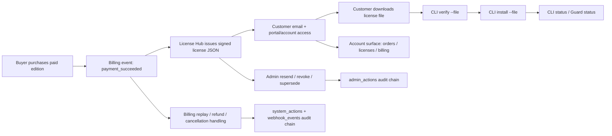

# User Journey

This journey describes the current commercial flow from purchase through local CLI activation guidance.

## Flow 1: purchase to working CLI

1. Buyer completes checkout for a paid edition.
2. Billing lifecycle receives `payment_succeeded`.
3. License Hub issues one signed license JSON for the order.
4. Customer receives delivery through email and/or portal/account surface.
5. Customer downloads the license file.
6. Customer runs:
   - `guard license verify --file downloaded-license.json`
   - `guard license install --file downloaded-license.json`
   - `guard license status`
   - `guard status`
7. Customer now has local, offline CLI entitlement.

## Flow 2: customer self-serve visibility

The customer can sign into License Hub and use:

- `/portal` for delivery and download
- `/account` for broader visibility
- `/account/orders`
- `/account/licenses`
- `/account/billing`

This supports self-serve inspection without moving runtime authority into the service.

## Flow 3: admin operations

Operators can:

- resend the current signed license
- revoke a license
- extend by replacement
- supersede by replacement

These actions are auditable through `admin_actions`.

## Flow 4: transaction lifecycle handling

Billing lifecycle handling covers:

- payment success
- replay/idempotency
- payment failed
- refund
- cancellation

These changes update order/license state and write:

- `webhook_events`
- `system_actions`

## Flow 5: optional future online posture

Phase 6 introduces account, seats, and activation skeletons, but the authority order remains:

1. local signed license file
2. CLI verify / install / status
3. optional online/account-connected surfaces

Online activation is not required for the current product baseline.
